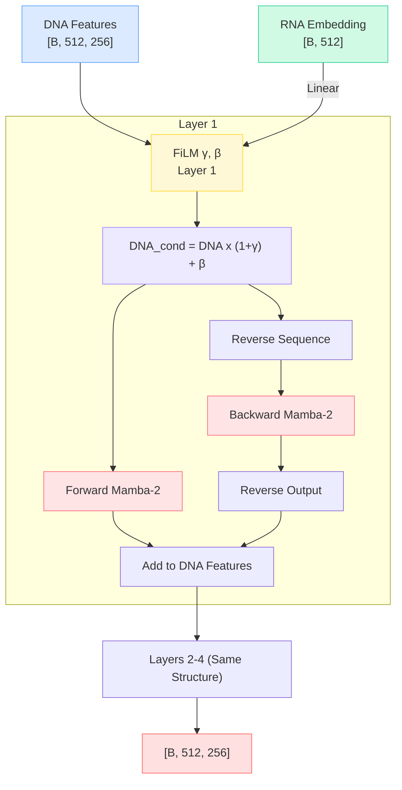

# BiMamba SSM - Cell-Conditioned Sequence Modeling

The core sequence modeling engine of Deep-H is a stack of 4 **Bidirectional Mamba-2** (BiMamba) layers. Mamba-2 is a state-of-the-art selective state space model that processes sequences in linear time O(L) while maintaining a theoretically infinite receptive field.

## Why Mamba instead of Transformers?

DNA sequences are long (32,768 bp). Even after downsampling to 512 tokens via the CNN stem, self-attention scales quadratically, making it memory-intensive and slow. Mamba-2 scales **linearly**, allowing Deep-H to process long genomic contexts efficiently without sacrificing performance.

## Architecture



## 1. Per-Layer FiLM Conditioning

Before each Mamba layer, the DNA features are modulated by the cell-type RNA embedding using Feature-wise Linear Modulation (FiLM):

```python
gamma = self.film_gammas[layer_idx](rna_emb).unsqueeze(1)
beta  = self.film_betas[layer_idx](rna_emb).unsqueeze(1)
dna_cond = (1 + gamma) * dna_feat + beta
```

!!! tip "Why Per-Layer?"
    Applying FiLM at every layer allows the network to learn **hierarchical cell-type features**. Layer 1 might learn coarse cell-type patterns (e.g., "is this a stem cell?"), while Layer 4 learns fine-grained, context-specific effects.

## 2. Bidirectional Scanning

DNA is symmetric: a peak at position $X$ is influenced by sequence features both upstream and downstream. Mamba is inherently unidirectional, so Deep-H runs two Mamba blocks in parallel:

1. **Forward:** Scans $5' \rightarrow 3'$
2. **Backward:** Sequence is flipped, scanned $5' \rightarrow 3'$, then output is flipped back.

```python
fwd_out = checkpoint(fwd_layer, dna_cond, use_reentrant=False)
bwd_out = checkpoint(bwd_layer, dna_cond.flip(1), use_reentrant=False).flip(1)
dna_feat = dna_feat + fwd_out + bwd_out
```

## 3. Position-Specific Cross-Attention

After the 4 BiMamba layers, Deep-H uses a **Cross-Attention** module where DNA positions query RNA tokens:

```python
rna_tokens = self.rna_to_tokens(rna_emb).view(B, self.num_rna_tokens, 256)
cross_out, _ = self.cross_attn(query=dna_feat, key=rna_tokens, value=rna_tokens)
dna_feat = self.cross_attn_norm(dna_feat + cross_out)
```

!!! example "Biological Intuition"
    Token at pos 100 (CpG island) attends to developmental genes. Token at pos 400 (repeat element) attends to heterochromatin genes. This provides **genuine position x cell-type interaction**.

---

**Next:** [Prediction Heads →](heads.md)
