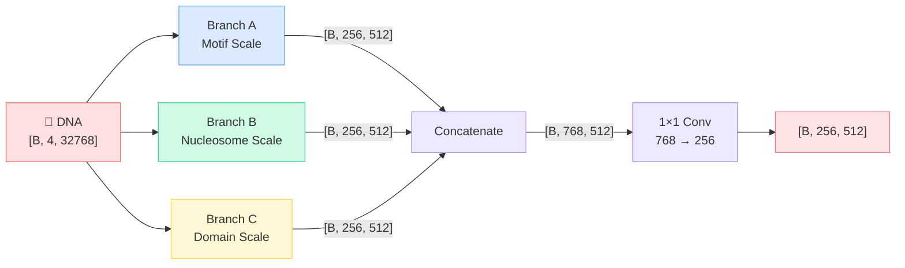

# DNA Encoder - Multi-Resolution CNN Stem

The DNA encoder is a **three-branch convolutional stem** that extracts features at multiple spatial scales simultaneously. This design captures motifs from single transcription factor binding sites (~10 bp) to entire regulatory domains (~10 kb).

## Why Multi-Resolution?

Different histone marks are driven by features at different scales:

| Scale | Size | Biological Features | Relevant Marks |
|-------|------|-------------------|----------------|
| **Motif** | 6–15 bp | TF binding sites, CpG dinucleotides | H3K4me3 (promoter) |
| **Nucleosome** | 147–200 bp | Nucleosome positioning, phasing | H3K27ac (enhancer) |
| **Domain** | 1–30 kb | TADs, LADs, chromatin compartments | H3K27me3, H3K9me3 |

A single-resolution CNN would need extremely deep stacking to capture all scales. Instead, Deep-H uses **parallel branches** with different kernel sizes and strides.

## Architecture



## Branch A - Motif Scale

Focuses on **short-range patterns** like transcription factor binding motifs (6–15 bp):

```python
self.cnn_a = nn.Sequential(
    nn.Conv1d(4, 128, 15, stride=1, padding=7),   # k=15: TF motifs
    nn.BatchNorm1d(128), nn.GELU(),
    nn.Conv1d(128, 256, 9, stride=4, padding=4),   # Downsample 4×
    nn.BatchNorm1d(256), nn.GELU(),
    nn.Conv1d(256, 256, 9, stride=4, padding=4),   # Downsample 4×
    nn.BatchNorm1d(256), nn.GELU(),
    nn.Conv1d(256, 256, 5, stride=4, padding=2),   # Downsample 4×
    nn.BatchNorm1d(256), nn.GELU(),
)
# Total stride: 1 × 4 × 4 × 4 = 64
# Output: [B, 256, 512]  (32768 / 64 = 512 tokens)
```

!!! info "Receptive Field"
    Each output token in Branch A has a receptive field of **~240 bp** - perfect for detecting clusters of TF binding sites within a promoter.

## Branch B - Nucleosome Scale

Captures **medium-range patterns** like nucleosome positioning (147–200 bp):

```python
self.cnn_b = nn.Sequential(
    nn.Conv1d(4, 128, 15, stride=1, padding=7),    # k=15 initial filter
    nn.BatchNorm1d(128), nn.GELU(),
    nn.Conv1d(128, 256, 15, stride=8, padding=7),   # k=15, stride=8: nucleosome
    nn.BatchNorm1d(256), nn.GELU(),
    nn.Conv1d(256, 256, 9, stride=8, padding=4),    # Downsample 8×
    nn.BatchNorm1d(256), nn.GELU(),
)
# Total stride: 1 × 8 × 8 = 64
# Output: [B, 256, 512]
```

!!! tip "Wider Strides"
    By using stride=8 instead of stride=4, Branch B sees a wider context per step. The larger first-layer kernel (k=15) at stride=8 captures the ~147 bp periodicity of nucleosome arrays.

## Branch C - Domain Scale

Captures **long-range patterns** spanning kilobases - important for broad repressive marks:

```python
self.cnn_c = nn.Sequential(
    nn.Conv1d(4, 64, 31, stride=4, padding=15),    # k=31: very wide filter
    nn.BatchNorm1d(64), nn.GELU(),
    nn.Conv1d(64, 128, 15, stride=4, padding=7),   # Downsample 4×
    nn.BatchNorm1d(128), nn.GELU(),
    nn.Conv1d(128, 256, 9, stride=4, padding=4),   # Downsample 4×
    nn.BatchNorm1d(256), nn.GELU(),
)
# Total stride: 4 × 4 × 4 = 64
# Output: [B, 256, 512]
```

!!! note "Largest Kernel"
    The initial k=31 convolution in Branch C spans ~31 bp in the first layer, but after strides accumulate, each output token sees a receptive field of **>2,000 bp** - capturing features at the kilobase scale relevant to H3K27me3 and H3K9me3 domains.

## Merge Projection

The three branch outputs are concatenated along the channel dimension and projected down:

```python
self.cnn_merge = nn.Sequential(
    nn.Conv1d(768, config.D_MODEL, 1),  # 768 → 256 via 1×1 conv
    nn.BatchNorm1d(config.D_MODEL),
    nn.GELU()
)
```

**Final output:** `[B, 256, 512]` → transposed to `[B, 512, 256]` for the sequence model.

Each of the **512 tokens** represents **64 bp** of genomic sequence, enriched with multi-scale features from all three branches.

---

**Next:** [RNA Encoder →](rna_encoder.md)
