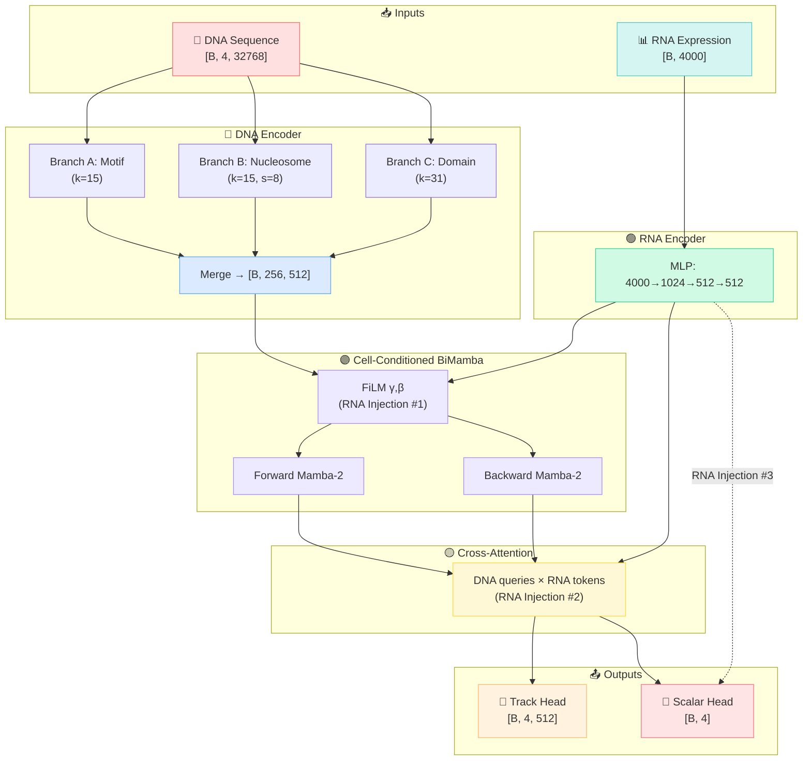

# Model Architecture - Overview

Deep-H's architecture is a **multi-modal fusion network** that combines genomic DNA features with cell-type RNA expression to predict histone modifications. The model is defined in `model.py` as the `ChromaRegressor` class.

## Architecture Summary

The model processes two inputs through specialized encoders and fuses them at multiple stages:

## The Three RNA Injections

Deep-H's key innovation is injecting cell-type identity at **three distinct levels**, each serving a different purpose:

  

    ①
    <h3>Per-Layer FiLM Conditioning</h3>
    
<strong>Where:</strong> Before each of the 4 BiMamba layers. 
    <strong>How:</strong> RNA → γ, β → affine transform on DNA features. 
    <strong>Why:</strong> Applies the <em>same</em> cell-type modulation to every DNA position - teaches the model coarse cell-type-specific patterns.

    Global modulation
  

  

    ②
    <h3>Cross-Attention</h3>
    
<strong>Where:</strong> After all BiMamba layers. 
    <strong>How:</strong> Each DNA position <em>independently queries</em> 8 RNA pseudo-tokens. 
    <strong>Why:</strong> A CpG island position can attend to developmental genes; a repeat position to heterochromatin genes. Genuine position × cell-type interaction.

    Position-specific
  

  

    ③
    <h3>Head Concatenation</h3>
    
<strong>Where:</strong> At each regression head. 
    <strong>How:</strong> RNA embedding concatenated with pooled DNA features → MLP. 
    <strong>Why:</strong> Direct shortcut ensuring cell-type identity reaches the final prediction even if upstream conditioning is subtle.

    Direct shortcut
  

## Component Summary

| Component | Parameters | Input → Output | Purpose |
|-----------|-----------|----------------|---------|
| Multi-Resolution CNN | ~1.2M | [4, 32768] → [256, 512] | Multi-scale DNA feature extraction |
| RNA MLP | ~4.8M | [4000] → [512] | Cell-type identity compression |
| FiLM Layers (×4) | ~0.5M | [512] → γ, β per layer | Global cell conditioning |
| BiMamba-2 (×4) | ~5.4M | [512, 256] → [512, 256] | Bidirectional sequence modeling |
| Cross-Attention | ~0.8M | DNA × RNA → [512, 256] | Position-specific conditioning |
| Scalar Heads (×4) | ~1.1M | [512] → [4] | Per-mark intensity prediction |
| Track Head | ~1.0M | [256, 512] → [4, 512] | Spatial peak localization |
| **Total** | **~14.8M** | | |

## Detailed Component Pages

Explore each component in depth:

- **[DNA Encoder →](dna_encoder.md)** - Multi-resolution CNN stem
- **[RNA Encoder →](rna_encoder.md)** - MLP compression of gene expression
- **[BiMamba SSM →](bimamba.md)** - Bidirectional state space model with FiLM
- **[Prediction Heads →](heads.md)** - Scalar and track output heads
