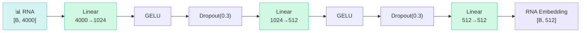

# RNA Encoder - Cell-Type Identity Compression

The RNA encoder is a **3-layer MLP** that compresses the 4,000-dimensional gene expression profile into a compact 512-dimensional cell-type embedding. This embedding serves as the "cell-type fingerprint" used throughout the network.

## Why RNA?

The same DNA sequence can have **completely different histone marks** in different cell types:

- **chr1:1,000,000** in an embryonic stem cell → H3K4me3 (active)
- **chr1:1,000,000** in a differentiated neuron → H3K27me3 (silenced)

The DNA sequence is identical - what changes is the **cellular context**. RNA expression captures this context.

## Architecture



```python
self.rna_mlp = nn.Sequential(
    nn.Linear(config.RNA_INPUT_DIM, 1024),     # 4000 → 1024
    nn.GELU(),
    nn.Dropout(config.DROPOUT),                 # 0.3
    nn.Linear(1024, config.RNA_HIDDEN_DIM),     # 1024 → 512
    nn.GELU(),
    nn.Dropout(config.DROPOUT),
    nn.Linear(config.RNA_HIDDEN_DIM, config.RNA_HIDDEN_DIM),  # 512 → 512
)
```

## Design Decisions

!!! tip "Why 3 Layers?"
    Two layers (4000→512→512) compress too aggressively - the extra 1024-dimensional hidden layer provides a **bottleneck** that forces the network to learn the most informative gene expression patterns before compression.

!!! info "Why 4,000 Genes?"
    The top 4,000 most variable genes across all 440 cell lines capture >95% of the variance in cell-type identity. Using all ~20,000 genes adds noise from housekeeping genes that don't distinguish cell types.

!!! warning "Dropout at 0.3"
    Aggressive dropout prevents the RNA encoder from memorizing cell-line-specific noise. At inference time, the model must rely on **general expression patterns** - making it more robust to unseen cell types.

## How the RNA Embedding is Used

The 512-dimensional RNA embedding feeds into **three different downstream modules**:

| Module | Input | Transformation | Purpose |
|--------|-------|----------------|---------|
| FiLM γ, β | [B, 512] | Linear → [B, 256] each | Global cell-type modulation of DNA features |
| Cross-Attention | [B, 512] | Linear → [B, 8, 256] | Position-specific RNA tokens for DNA queries |
| Head Projection | [B, 512] | Linear+GELU → [B, 256] | Direct concat with pooled DNA at heads |

---

**Next:** [BiMamba SSM →](bimamba.md)
