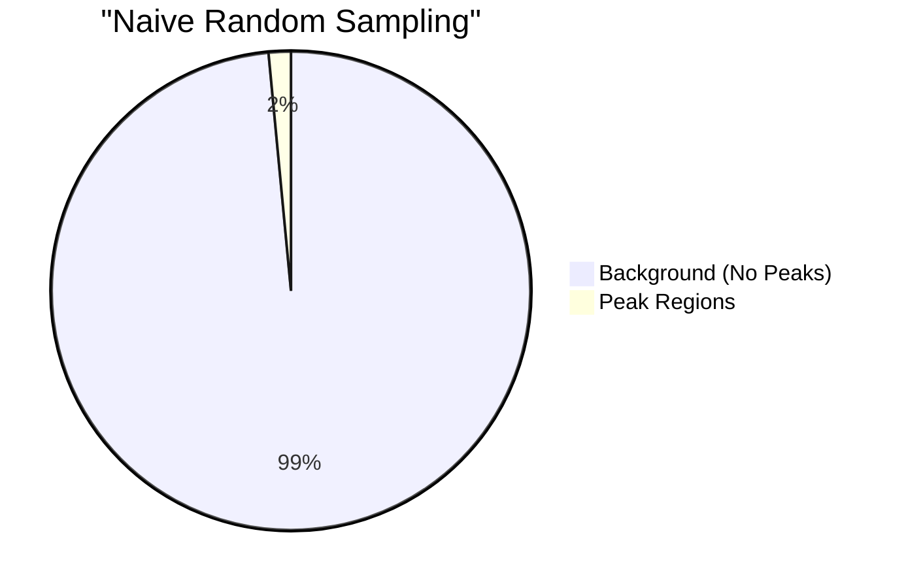

# Data Construction

This page explains how Deep-H constructs its training dataset from raw biological data — covering the three data sources and the window sampling strategy that balances peak-rich and background regions.

## Raw Data Sources

Deep-H requires three types of input data:

### 🧬 1. Reference Genome (hg38)

The human reference genome provides the DNA sequence context for every training window.

```
hg38.fa — 3.1 billion base pairs
├── chr1  (248,956,422 bp)
├── chr2  (242,193,529 bp)
├── ...
└── chrY  (57,227,415 bp)
```

!!! info "Genome Cache"
    For speed, Deep-H pre-converts the FASTA into a **binary cache** (`genome_hg38.bin`) at first run. This enables O(1) random access to any genomic coordinate — critical for the DataLoader's 16 parallel workers.

    ```python
    # genome_cache.py
    class GenomeCache:
        """Memory-mapped binary genome for instant sequence retrieval."""
        def get_seq(self, chrom, start, end):
            # Returns uint8 array: {0=A, 1=C, 2=G, 3=T, 4=N}
            return self.mmap[offset:offset+length]
    ```

### 📊 2. RNA-seq Expression Profiles

Each cell line has a **4,000-dimensional expression vector** representing the most variable genes across all 440 cell lines.

```python
# The RNA fingerprint for each cell line
rna_map = {
    "K562":     np.array([3.2, 0.0, 7.1, ...]),  # 4000 genes
    "HeLa-S3":  np.array([0.5, 4.8, 2.3, ...]),  # 4000 genes
    "GM12878":   np.array([6.1, 1.2, 0.8, ...]),  # 4000 genes
    # ... 440 cell lines total
}
```

!!! tip "Why Top 4,000 Genes?"
    Using all ~20,000 genes would add unnecessary noise. The top 4,000 most variable genes capture >95% of the cell-type identity information while keeping the input dimension manageable.

### 📋 3. ChIP-seq BED Files (Ground Truth)

For each cell line, BED files define the **genomic coordinates where each histone mark is present**:

```
# Example: H3K27ac.bed for cell line K562
chr1    10400    10600    .    5.3    .    ...
chr1    28600    29400    .    7.1    .    ...
chr1    180700   181200   .    3.8    .    ...
```

<div class="stats-row">
  <div class="stat-card stat-coral">
    <span class="stat-value">440</span>
    <span class="stat-label">Cell Lines</span>
  </div>
  <div class="stat-card stat-turquoise">
    <span class="stat-value">4</span>
    <span class="stat-label">Histone Marks</span>
  </div>
  <div class="stat-card stat-lavender">
    <span class="stat-value">~1,760</span>
    <span class="stat-label">BED Files</span>
  </div>
  <div class="stat-card stat-golden">
    <span class="stat-value">~50M</span>
    <span class="stat-label">Total Peaks</span>
  </div>
</div>

!!! warning "Not All Marks Available"
    Some cell lines only have data for 1–3 of the 4 marks. Deep-H handles this gracefully with a **validity mask** — missing marks are excluded from loss computation during training.

---

## Window Sampling Strategy

The most critical design decision in Deep-H's data pipeline is **how we sample training windows**. Naive random sampling would produce >98% background (no peaks), making it impossible for the model to learn peak patterns.

### The Class Imbalance Problem



Active marks like H3K27ac have tens of thousands of peaks per cell line, but repressive marks like H3K9me3 may have only **50–200 peaks** in some cell lines.

### Deep-H's Balanced Sampling

Deep-H uses a **50/50 peak-to-background ratio** with intelligent oversampling:

```python
# config.py
PEAK_FRAC = 0.50      # 50% peak-centered windows
BG_MARGIN = 20_000    # 20kb clearance for background windows
MAX_PEAKS_PER_MARK_PER_CELL = 3000
```

<div class="step-card">
  <div class="step-number step-coral">1</div>
  <div>
    <h3>Peak Window Sampling</h3>
    <p>For each cell line and each mark, sample up to <strong>3,000 peaks</strong>. If a mark has fewer peaks (common for H3K27me3/H3K9me3), <strong>oversample with replacement</strong> up to 3× the available peaks.</p>
    <span class="chip chip-coral">50% of total windows</span>
  </div>
</div>

<div class="step-card">
  <div class="step-number step-turquoise">2</div>
  <div>
    <h3>Background Window Sampling</h3>
    <p>Sample background windows from random genomic locations that are <strong>≥20 kb from any peak</strong> of any mark. This margin ensures the model learns genuine background, not the edges of broad peaks.</p>
    <span class="chip chip-turquoise">50% of total windows</span>
  </div>
</div>

<div class="step-card">
  <div class="step-number step-lavender">3</div>
  <div>
    <h3>Shuffle & Cache</h3>
    <p>All peak + background windows are shuffled together and <strong>cached to disk</strong> as a pickle file. On subsequent runs, the cache is validated against current config and reused if valid.</p>
    <span class="chip chip-lavender">Cached for fast restart</span>
  </div>
</div>

### Why Oversampling Sparse Marks?

Without oversampling, the training distribution is heavily skewed:

| Mark | Peaks per Cell (median) | Without Oversampling | With Oversampling |
|------|------------------------|---------------------|-------------------|
| H3K27ac | 42,000 | 73% of training signal | 25% |
| H3K4me3 | 25,000 | 22% | 25% |
| H3K27me3 | 800 | 4% | 25% |
| H3K9me3 | 150 | <1% | 25% |

!!! tip "Key Insight"
    Oversampling with replacement + random offset augmentation (±2000 bp) means the model sees the same peak **multiple times** but with **different surrounding DNA context** each time — preventing memorization while ensuring rare marks get adequate training signal.

### Cache Validation

The cached windows include metadata to detect stale data:

```python
payload = {
    "cache_version": 2,
    "cell_lines": list(self.cell_lines),
    "target_marks": list(config.TARGET_MARKS),
    "window_size": config.WINDOW_SIZE,
    "max_peaks_per_mark_per_cell": config.MAX_PEAKS_PER_MARK_PER_CELL,
    "peak_frac": config.PEAK_FRAC,
    "bg_margin": config.BG_MARGIN,
    "windows": self.windows,
}
```

If any of these parameters change between runs, the cache is automatically rebuilt.

---

**Next:** [Feature Engineering →](features.md)
