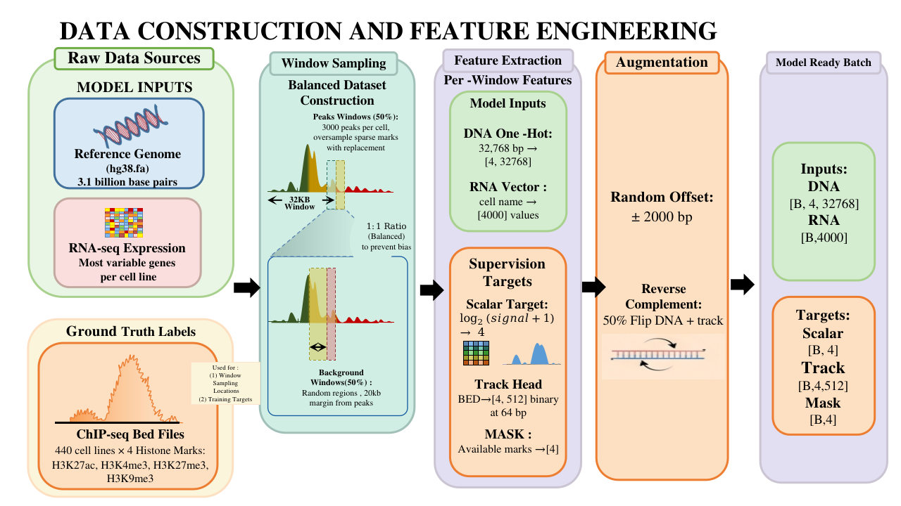
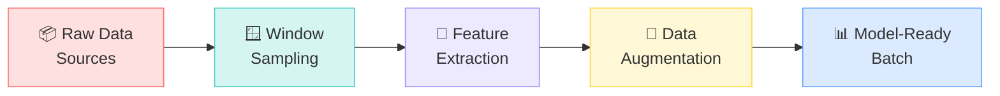

# Data Pipeline — Overview

HERON's data pipeline transforms raw biological data into model-ready tensors. This page provides a high-level overview; subsequent pages dive into each stage.

  
  
<strong>Figure:</strong> Complete data construction and feature engineering pipeline — from raw data sources to model-ready batches

## Pipeline Stages

The pipeline has **five major stages**, each designed to address specific challenges in epigenomic data:

  

    📦
    <h3>1. Raw Data Sources</h3>
    
Three inputs: hg38 reference genome (FASTA), RNA-seq expression per cell line, and ChIP-seq BED files for 4 histone marks across 440 cell lines.

  

  

    🪟
    <h3>2. Window Sampling</h3>
    
Balanced 50/50 peak/background sampling with smart oversampling for rare marks. 3000 peaks per mark per cell, backgrounds kept 20kb from any peak.

  

  

    🔬
    <h3>3. Feature Extraction</h3>
    
DNA → one-hot [4, 32768]. RNA → top 4000 gene expression vector. Targets → scalar log₂(signal+1) + binary track at 64bp bins.

  

  

    🔄
    <h3>4. Augmentation</h3>
    
Random offset ±2000bp for translation invariance + 50% reverse complement flip. Both DNA and track targets are flipped together.

  

## Data Flow Summary

| Stage | Input | Output | Key Design Choice |
|-------|-------|--------|-------------------|
| Raw Sources | Genome FASTA, BED files, RNA-seq | Indexed data structures | Binary genome cache for O(1) lookup |
| Window Sampling | Peak coordinates, cell list | (cell, chrom, center) tuples | Oversample sparse marks with replacement |
| Feature Extraction | Window coordinates | DNA, RNA, targets, masks | Mask-based loss handles missing marks |
| Augmentation | Raw features | Augmented features | RC flip + offset preserve biology |
| Batching | Augmented features | `[B, 4, 32768]`, `[B, 4000]` | PyTorch DataLoader with 16 workers |

---

**Next:** [Data Construction →](construction.md) · [Feature Engineering →](features.md)
