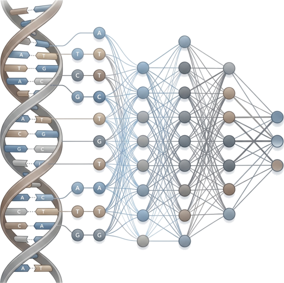
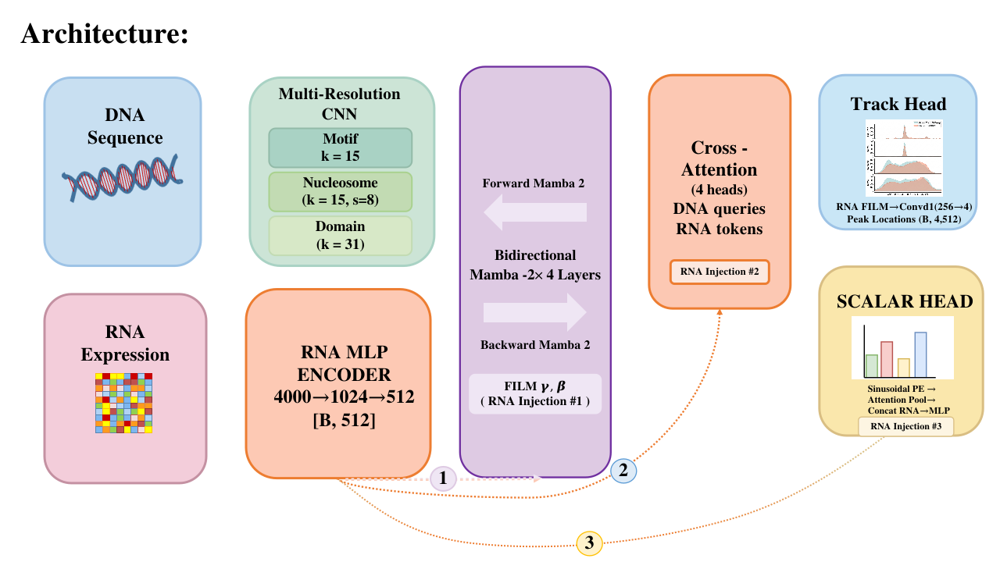
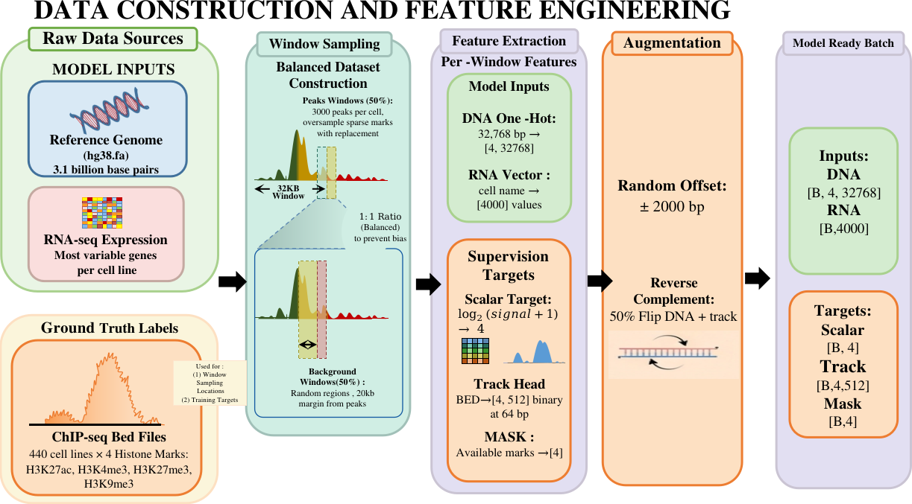
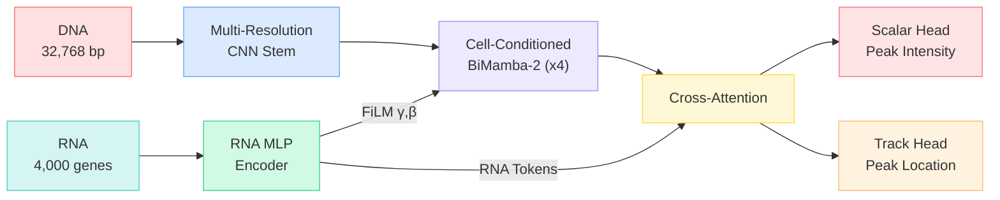

---
hide:
  - navigation
  - toc
---

<h1 class="deeph-title">
  
  <span>Deep-H</span>
</h1>

<p class="hero-subtitle">
Predicting cell-type-specific histone landscapes directly from DNA sequence and RNA expression profiles.
</p>

<div class="hero-badges">
  <span class="hero-badge badge-lavender">BiMamba-2 SSM</span>
  <span class="hero-badge badge-coral">4 Histone Marks</span>
  <span class="hero-badge badge-turquoise">440 Cell Lines</span>
  <span class="hero-badge badge-golden">RNA-Conditioned</span>
  <span class="hero-badge badge-sky">Dual-Head Output</span>
</div>

<div class="diagram-container hero-visual">
  
</div>

## What is Deep-H?

Deep-H is an advanced deep learning framework designed to predict **four key histone modifications** across the genome for any given cell type. By integrating a 32,768 bp DNA sequence window with a cell line's specific RNA-seq expression profile (focusing on the top 4,000 most variable genes), Deep-H accurately outputs:

1. **Scalar predictions** - Estimating the peak intensity for each histone mark.
2. **Spatial track predictions** - Generating a detailed binary map that pinpoints exactly *where* these peaks occur at a precise 64 bp resolution.

<div class="diagram-container">
  
</div>

<div class="diagram-container">
  
</div>

## Target Histone Marks

<div class="feature-grid">
  <div class="feature-card coral">
    <h3>H3K27ac</h3>
    <p><strong>Active enhancers & promoters.</strong> This acetylation mark opens chromatin, enabling transcription factor binding. Found at active regulatory elements across the genome.</p>
    <span class="chip chip-coral">Activating</span>
  </div>
  <div class="feature-card turquoise">
    <h3>H3K4me3</h3>
    <p><strong>Active promoters.</strong> Trimethylation of H3K4 marks transcription start sites (TSS) of actively transcribed genes. Forms sharp, narrow peaks.</p>
    <span class="chip chip-turquoise">Activating</span>
  </div>
  <div class="feature-card lavender">
    <h3>H3K27me3</h3>
    <p><strong>Polycomb repression.</strong> This repressive mark is deposited by PRC2 to silence developmental genes. Forms broad domains spanning tens of kilobases.</p>
    <span class="chip chip-lavender">Repressive</span>
  </div>
  <div class="feature-card golden">
    <h3>H3K9me3</h3>
    <p><strong>Constitutive heterochromatin.</strong> Marks permanently silenced regions like centromeres and transposable elements. Prevents spurious transcription.</p>
    <span class="chip chip-golden">Repressive</span>
  </div>
</div>

## Key Numbers

<div class="stats-row">
  <div class="stat-card stat-lavender">
    <span class="stat-value">14.8M</span>
    <span class="stat-label">Parameters</span>
  </div>
  <div class="stat-card stat-coral">
    <span class="stat-value">440</span>
    <span class="stat-label">Cell Lines</span>
  </div>
  <div class="stat-card stat-turquoise">
    <span class="stat-value">32,768</span>
    <span class="stat-label">bp Window</span>
  </div>
  <div class="stat-card stat-golden">
    <span class="stat-value">4,000</span>
    <span class="stat-label">RNA Genes</span>
  </div>
  <div class="stat-card stat-sky">
    <span class="stat-value">512</span>
    <span class="stat-label">Track Bins</span>
  </div>
</div>

## Why Deep-H?

!!! tip "Cell-Type Awareness"
    Unlike models that only see DNA, Deep-H conditions on **RNA expression** at three levels of the network, enabling it to predict histone marks for **any cell type**, not just the ones it was trained on.

!!! info "Bidirectional State Space Model"
    Deep-H uses **Mamba-2**, a state-of-the-art selective state space model, for O(L) sequence processing. Bidirectional scanning captures both upstream and downstream regulatory context.

!!! example "Dual-Head Architecture"
    Simultaneously predicts **scalar intensity** (how strong is the signal?) and **spatial track** (where exactly are the peaks?), giving researchers both the big picture and the fine details.

## Architecture at a Glance



## Quick Start

```bash
# Clone the repository
git clone https://github.com/shreya1/hist4.1.git
cd hist4.1

# Install dependencies
pip install -r requirements.txt

# Run training
python train.py
```
